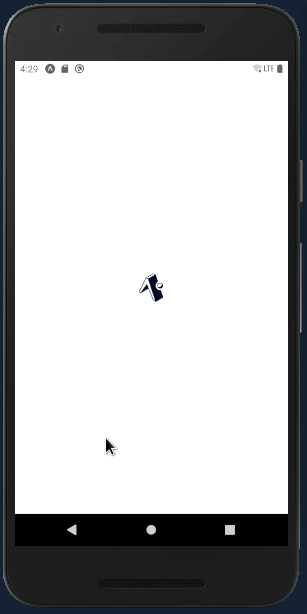
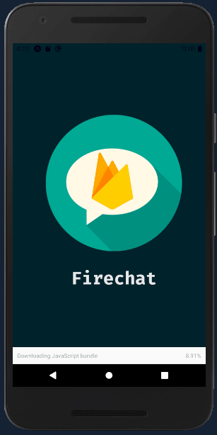

<h1 align="center">Firechat</h1>

<p align="center">Firechat is a react native application to chat and manage conversations.</p>
<p align="center" style="text-align: center;">Using the firebase database realtime.</p>

<p align="center">
  
  <a aria-label="React Version" href="https://github.com/facebook/react-native">
    </img>
  </a>
  <a aria-label="Github API" href="https://github.com/mycatdoitbetter/hermes-backend">
    </img>
  </a>

</p>

<table border="0" align="center"> 
 
  <tr align="center">
     <td>
       <p>
        
       </p>
     </td>
     <td>
      <p>
        
       </p>
     </td>
  </tr>
 </table>

 <p align="center">

  
</p>
 To init this application,you can install your real device or in a emulator, doing:
 ```bash
 cd hermes-mobile
 yarn
 yarn android
 ```
In some cases, the bundle will not start, so, do you have to init with:
```bash
yarn start
```
